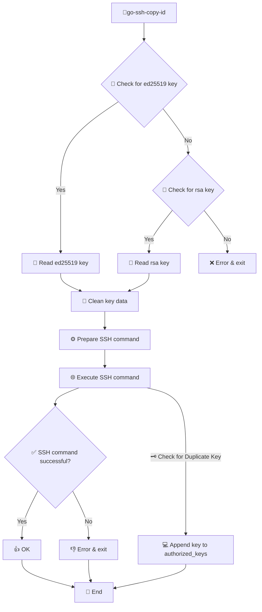

# go-ssh-copy-id

go-ssh-copy-id is an implementation of ssh-copy-id for Windows. 
It is a static binary with no dependencies other than native ssh client
that already is in modern Windows.

An Apple OSX build has been added (because golang makes it trivial to
add another build).

## Usage

```
Usage: go-ssh-copy-id user@host[:port] [-i=/path/to/key.pub] [-p=22]

Options:
-i      Path to your public SSH key (optional)
-p      SSH port (optional, default is 22)
-h      Display this help message
-v      Display version information

```



```mermaid
 graph TD
    A[🚪go-ssh-copy-id] --> B{🔑 Check for ed25519 key}
    B -->|Yes| C[📄 Read ed25519 key]
    B -->|No| D{🔑 Check for rsa key}
    D -->|Yes| E[📄 Read rsa key]
    D -->|No| F[❌ Error & exit]
    C --> G[🧹 Clean key data]
    E --> G
    G --> H[⚙️ Prepare SSH command]
    H --> I[🌐 Execute SSH command]
    I --> J{✅ SSH command successful?}
    J -->|Yes| K[👍 OK ]
    J -->|No| L[👎 Error & exit]
    K --> M[🏁 End]
    L --> M
    I --> |🗝 Check for Duplicate Key| N[💻 Append key to authorized_keys]
    N --> M 
```

## Notes & Limitations

* Checks for duplicate keys (v1.01)
* Assumes remote hosts are unix/linux and conform to standard path for authorized_keys file

It is not possible in either this or in linux ssh-copy-id to directly install a public key to a remote host
via JumpHost (aka Proxy ssh system). However this can be worked around with a port forward in another terminal temporarily
by running something like this:


```
ssh -L 9022:127.0.0.1:22 -J jumphost user@target-system
```

That assumes jumphost is defined in your .ssh\config. Then use go-ssh-copy-id against the localhost temporary tunnel:


```
go-ssh-copy-id.exe -i .\.ssh\my-key user@127.0.0.1:9022 # where 127.0.0.1:9022 is really the target-system
Sending public key via single ssh session...
The authenticity of host '[127.0.0.1]:9022 ([127.0.0.1]:9022)' can't be established.
ED25519 key fingerprint is SHA256:blah/blahblahblah
This host key is known by the following other names/addresses:
    C:\Users\localuser/.ssh/known_hosts:91: 192.168.123.456
Are you sure you want to continue connecting (yes/no/[fingerprint])? yes
Warning: Permanently added '[127.0.0.1]:9022' (ED25519) to the list of known hosts.
user@127.0.0.1's password:
✅ Public key installed successfully.

```


