# go-ssh-copy-id

go-ssh-copy-id is an implementation of ssh-copy-id for Windows. 
It is a static binary with no dependencies other than native ssh client
that already is in modern Windows.

An Apple OSX build has been added (because golang makes it trivial to
add another build).

## Usage

```
Usage: go-ssh-copy-id user@host[:port] [-i=/path/to/key.pub] [-p=22]

Options:
-i      Path to your public SSH key (optional)
-p      SSH port (optional, default is 22)
-h      Display this help message
-v      Display version information

```




```mermaid
 graph TD
    A[🚪go-ssh-copy-id] --> B{🔑 Check for ed25519 key}
    B -->|Yes| C[📄 Read ed25519 key]
    B -->|No| D{🔑 Check for rsa key}
    D -->|Yes| E[📄 Read rsa key]
    D -->|No| F[❌ Error & exit]
    C --> G[🧹 Clean key data]
    E --> G
    G --> H[⚙️ Prepare SSH command]
    H --> I[🌐 Execute SSH command]
    I --> J{✅ SSH command successful?}
    J -->|Yes| K[👍 OK ]
    J -->|No| L[👎 Error & exit]
    K --> M[🏁 End]
    L --> M
    I --> N[💻 Append key to authorized_keys]
    N --> M 
```

## Notes & Limitations

* Checks for duplicate keys (v1.01)
* Assumes remote hosts are unix/linux and conform to standard path for authorized_keys file
